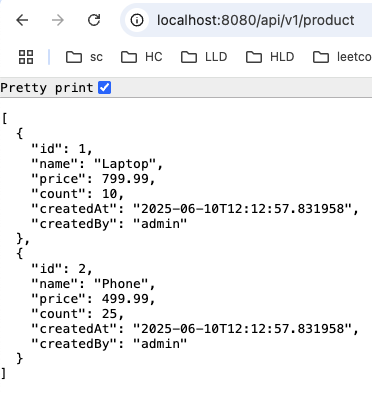
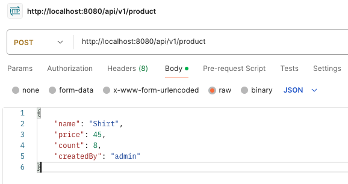
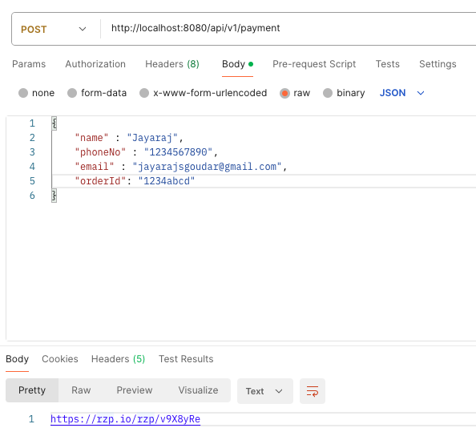
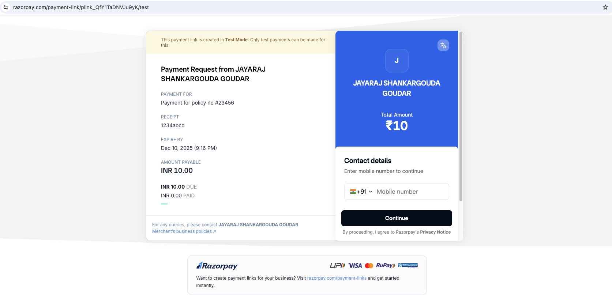
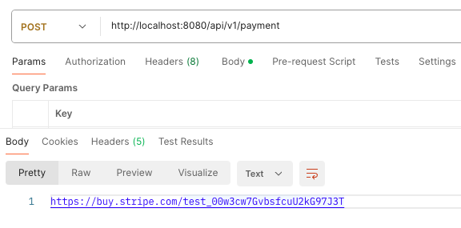
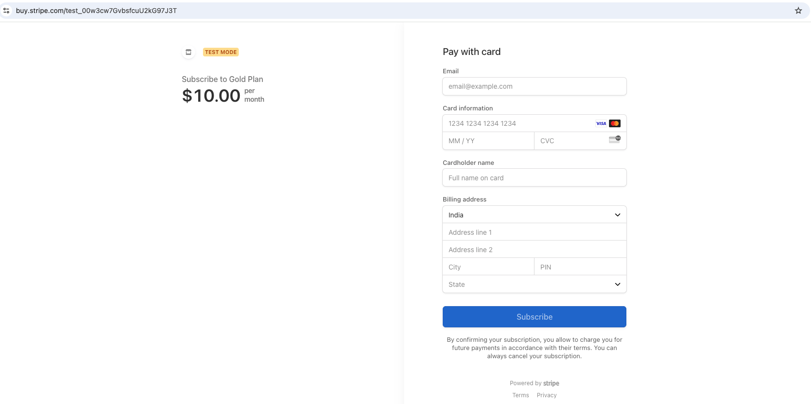
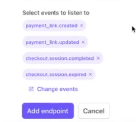

### Ecommerce API's
* GET : http://localhost:8080/api/v1/product

* POST : http://localhost:8080/api/v1/product
  

### Payment steps
* Razorpay integration (https://razorpay.com/docs/api/payments/payment-links/create-standard/)
* Get a payment link for order id (with the help of payment gateway) ⇒ navigate in UI (Navigation page)
* Outcome of payment page : `Success` ⇒ PG received money `Failure` ⇒ all other possibilities (Callback URL/Redirect URL)
* If payment is not completed within session or just in time, Razorpay/Stripe will call Webhook API (make sure to change endpoint regularly)

* Payment request ⇒ Gets payment URL
  

* Opening payment URL ⇒ Able to make payments
  

* Stripe integration (https://docs.stripe.com/api/payment-link)
  
  

* For any of these events, Stripe will invoke webhook API (use ngrok for safe tunnel instead of direct expose of payment status API's)
  

* TODO: reconcile API to handle any missed payments